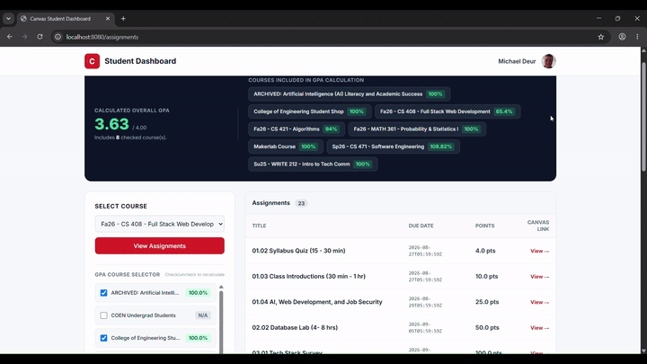

# 04.01: Mini-Lab Warmup 

* Author: Michael Deur
* Class: CS408
* Semester: Fall 2026

## Project Title: Canvas Assignment and GPA Dashboard

## Description

This program lets users easily calculate their GPA based by checking and 
unchecking which classes to be used to weigh against it. Additionally, 
the program displays your profile as well as making it easy to find 
assignments from each class, their points, and due dates.

## API Endpoints Used

| Method | Endpoint | Description & Data Retrieved |
| :--- | :--- | :--- |
| **GET** | `/api/v1/users/self/profile` | Retrieves the authenticated student's profile information, including display name and avatar URL for the dashboard header. |
| **GET** | `/api/v1/courses?enrollment_state=active&include[]=enrollments&include[]=total_scores` | Fetches all active enrolled courses along with total percentage scores used for interactive GPA calculation. |
| **GET** | `/api/v1/courses/:id/assignments` | Retrieves all assignments for a selected course, including title, due date, points possible, and Canvas direct links. |

## Reflection

Overall, this project was pretty enjoyable, and quite a fun learning 
experience. Before this project, I didn't know that it was possible to 
build and use data from Canvas for working on personal projects. Using a
complete tech stack for a larger project was also a fun as, this is also 
one of the few times I have been able to get a tech stack properly 
working, let alone a complete tech stack. The most enjoyable part was 
planning and customizing what the application was going to do as well as 
trying to figure out and identify any issues with the current Canvas that 
I wanted to solve. Two big issues for me were selectively being able to 
calculate GPA and easily see what and when assignments are due in each 
class. So, my program aims to solve those issues in a readable way.

Even though it was fun, the project was not very easy and I ran into a 
few challenges along the way. One challenge I ran into was trying to 
figure out how data transfer objects worked as well as why they were 
needed for the endpoints I was using. I was able to get this figured 
out though, and my knowledge in that area is a little bit better. Another 
big hurdle I ran into was understanding how to bridge between the
front end and backend using a framework, in this case Thymeleaf. I think 
there is still alot of capability here I am not taking advantage of and 
hope to learn in future projects, but I was able to figure out how to 
implement what I needed for my program after running into probably way 
to many errors.

There is actually alot that I want to improve on this site if I had more 
time. I would like to be able to not just calculate not just semester GPA 
but also calculate total cumulative GPA if possible, as well as potentially
be able to show a visual graph of what your GPA has looked like in 
college to be able to allow students to see if they are improving in the 
big picture, and not just in the moment. Additionally, I would also like 
to be able to do more than just display assignment due dates and points, 
but also recommend personal due dates which days and amount of time 
students should focus on working on a project. Finally, it would be cool 
to be able to use the program to be able to turn itself in, but I'm not 
quite that confident in being able to make that functionality reliable 
yet. I have a lot of other minor tweaks and plans for this as well, but 
we'll about getting these other potential features sorted out first.

## Setup Instructions

Follow these step-by-step instructions to get the application running on your computer.

---

### Prerequisites

1. **Git** (used to clone the project repository)
    * **Windows:** Download and run the installer from [git-scm.com](https://git-scm.com/download/win). Keep default settings during installation.
    * **macOS:** Open the **Terminal** app (`Cmd + Space` $\rightarrow$ type `Terminal` $\rightarrow$ press `Enter`), type `git --version`, and press `Enter`. If prompted, follow the on-screen prompt to install Apple Command Line Tools.

2. **IntelliJ IDEA** (Community or Ultimate Edition)
    * Download and install from [JetBrains IntelliJ IDEA](https://www.jetbrains.com/idea/download/).

3. **Java 17 Development Kit (JDK 17)**
    * Download JDK 17 from [Eclipse Temurin (Adoptium)](https://adoptium.net/temurin/releases/?version=17). Alternatively, IntelliJ can download JDK 17 automatically in Step 3.

---

### Step 1: Clone the Repository

1. Open your terminal or command prompt:
    * **Windows:** Press `Windows Key + R`, type `cmd`, and press `Enter`.
    * **macOS:** Press `Cmd + Space`, type `Terminal`, and press `Enter`.
2. Run the following command to download the project:

    If SSH keys set up already:
   ```bash
   git clone git@github.com:michaeldeur/canvas-mini-lab.git
   ```
   Else:
   ```bash
   git clone https://github.com/michaeldeur/canvas-mini-lab.git
   ```

## Step 2: Create Your .env File (API Key Setup)
Navigate into the project folder:
```bash
cd canvas-mini-lab
```
Create and open a .env file:  
Windows (cmd): Type `notepad .env` and press Enter. 
(NOTE: Click Yes when asked to create a new file).

macOS (Terminal): Type `nano .env` and press Enter.  

Paste the following lines into the file (replace **your_token_here** with your actual Canvas API token):
```
CANVAS_API_TOKEN=your_token_here
CANVAS_BASE_URL=https://boisestatecanvas.instructure.com
```
Save and close the file:

Windows: Press Ctrl + S to save, then close Notepad.

macOS: Press Ctrl + O, press Enter, then press Ctrl + X to exit Nano.

**NOTE: Never commit your .env file to GitHub. It is listed in .gitignore to protect your token.**

## Step 3: Open the Project in IntelliJ IDEA
Launch IntelliJ IDEA. Click Open on the welcome screen (or go to File $\rightarrow$ Open...). 
Select the canvas-mini-lab folder you cloned in Step 1 and click OK. 
If prompted, select Trust Project. Ensure Project SDK is set to Java 17: Go to File $\rightarrow$ Project Structure $\rightarrow$ Project. 
Under SDK, select 17 (Oracle OpenJDK or Temurin). If Java 17 is not listed, click Download SDK, choose 17, and click Apply.

### Step 4: Run the Application
In the left Project View sidebar, expand the folders to find:src $\rightarrow$ main $\rightarrow$ java $\rightarrow$ com.example.canvasminilab $\rightarrow$ CanvasMiniLabApplication.java  

Double-click CanvasMiniLabApplication.java to open it in the editor. Open the right sidebar labeled Maven and expand the folders to find:canvasminilab $\rightarrow$ Lifecycle $\rightarrow$ install. 
Press install to download all of the required dependencies and then press the green Play button at the top of the screen. 
IntelliJ will compile the project, and start the Spring Boot server. When the bottom console window shows log output ending with:
```
Started CanvasMiniLabApplication in X.XXX seconds
```
Your application is live!

### Step 5: Access the Web Dashboard
Open any browser (Chrome, Edge, Safari, Firefox) and go to: http://localhost:8080.
To stop the application, click the red Stop button in the top-right toolbar of IntelliJ (or in the bottom Run window).
## Usage Examples

Once the application is running at http://localhost:8080:

### 1. Calculating Overall GPA & Filtering Courses
* Navigating to the homepage automatically fetches your active Canvas courses and percentage grades.
* Use the **GPA Course Selector** checkboxes on the left sidebar to check or uncheck individual courses.
* The **Calculated Overall GPA** card updates instantly in real time, displaying your adjusted GPA and total included classes.

### 2. Viewing Course Assignments
1. Open the **Select Course** dropdown menu on the left sidebar.
2. Choose an active course (e.g., `Fa26 - CS 408 - Full Stack Web Development`).
3. Click **View Assignments**. (NOTE: **View Assignments** takes a couple seconds to reload.)
4. The main panel populates a list of all assignments for that course, including titles, due dates, possible credit points, and links to the Canvas assignment.

## Demo
### 15 Second Demo GIF


NOTE: View Assignments takes a couple seconds to reload.

### 1 Minute Demo Video GIF



NOTE: View Assignments takes a couple seconds to reload.  
NOTE: Audio version of GIF in Demos folder.

## Requirements
### Functional Requirements
* **Calls at least two distinct Canvas API endpoints.**  
I call the endpoints for courses, enrollment, and profile.
* **Accepts user input.**  
The user can input through the course dropdown or by checking the boxes for calculating grades.
* **Produces formatted terminal output.**  
My program doesn't dump raw JSON to the user, but converts it to Java objects used in HTML templates.
* **Handles errors gracefully.**  
If there is an error, the error.html file will be triggered and show the error. Reloading, resets and tries to reload the main page.
* **Handles pagination.**  
I retrieve all pages and converts them through using DTOs.

### Non-Functional Requirements
* **No secrets in the repo**  
The .env file is ignored and an .env.example is in its place.
* **Clean code.**  
Code methods have Java Doc explanations and each section in index.html is documented for clarity.
* **Works out of the box**  
All needed setup instructions are in the README.md. I chose to require users to have Intellij as a prerequisite as it seemed to be the simplest way to used Maven.